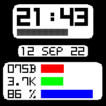
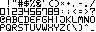

<link rel="stylesheet" href="README.css">

# personal digital clock - bangle.js 2

Just a simple watch face for your bangle.js 2 that shows you everything you need to know at a glance without being too flashy.

## the clock face

| clock with 24-hours and minutes |
|---|
| **second bar with 60 increments** |
| **current date** |
| **heart beat with a representing red bar** |
| **steps with a representing green bar** |
| **battery charge with a representing blue bar** |

## fonts of the pdc watch face

All fonts of the personal digital clock have been created from scratch. The fonts themselves are bitmaps, which were converted with the [espruino bitmap font convertor](http://ebfc.mattbrailsford.com/) by Matt Brailsford.

### font for the letters
The font for the letters uses 5x7px per symbol.

### font for the numbers
The font for the numbers uses 10x14px per symbol.

